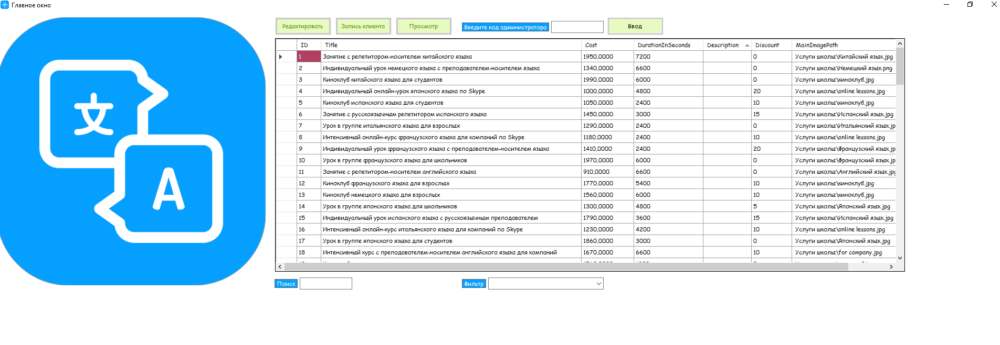

# Школа иностранных языков "Леарн"

Школа языков “Леарн” открывает большое количество дополнительных направлений в рамках
оказаний услуг, таких как: подготовка к ЕГЭ, тренировки к TOEFL, выездные кемпинги в другие страны и многое другое.

### Необходимые условия

Что нужно для установки программного обеспечения и как его установить

Компьютер на базе Windows OC 7.0 и выше
Библиотека .NET Framework 5.0 и выше 

### Установка
Скачайте и запустите Learn.exe

## Начало работы

Вас встретит главное окно приложения, на котором отображены доступные занятия

## Авторы

* **Пресняков Кирилл** - [19ip213](https://stud.scc/~19ip213)

